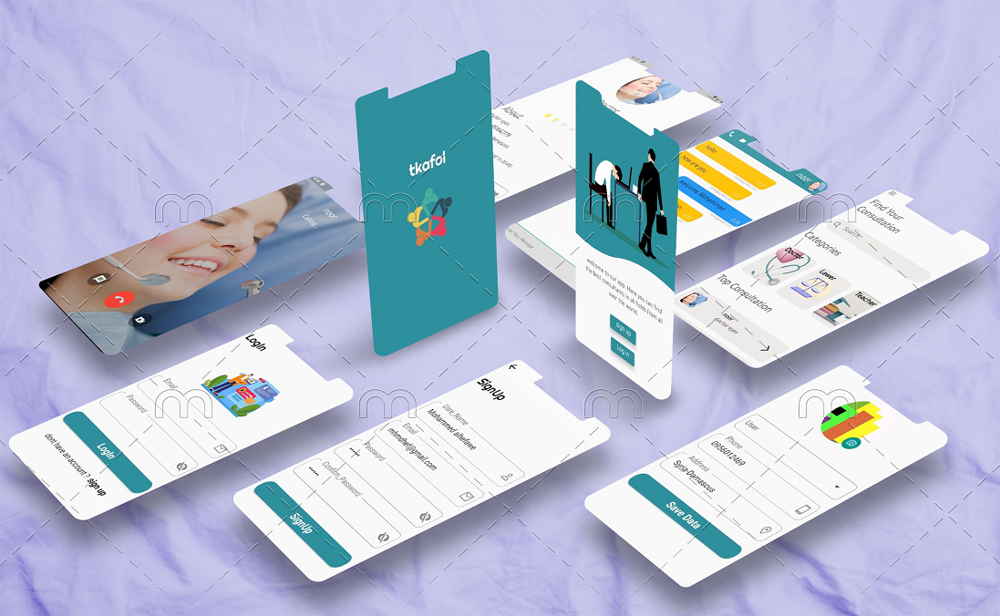

# tkafolapp
Application Consulting Services by flutter platform and php laravel 
Characteristics of the application in a nutshell:
- Registrations, logins and check-outs as a user or expert
- Search for the expert by name and filter the experts according to the quality of the service they provide
- Book an appointment with the expert according to the times specified by
- The payment process is done electronically
- The possibility of communicating with the expert within the application through messages or voice and video call.
- The possibility of evaluating the expert with the impact of this evaluation on the search results, so the most evaluated expert appears at the top of the search results.
- The possibility of adding the user to his favorite list.
- Night mode
-  Arabic and English 
-  User experience mode so that the expert can try the application as a regular user without having to activate a new account as a user.
